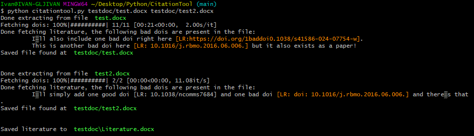

A single script that uses DOI to manually insert APA style references.
To use it, have a Word document that has a reference in the form of `[LR:{doi}]` where {doi} is a valid doi. For example, the following sentence:

>For example, according to [LR: https://doi.org/10.1016/j.cmet.2024.07.004] which is a single citation!

Links to a paper. The exact paper, formatted in APA style is:

>Zhang, Y., Wang, X., Lin, J., Liu, J., Wang, K., Nie, Q., Ye, C., Sun, L., Ma, Y., Qu, R., Mao, Y., Zhang, X., Lu, H., Xia, P., Zhao, D., Wang, G., Zhang, Z., Fu, W., Jiang, C., & Pang, Y. (2024). A microbial metabolite inhibits the HIF-2α-ceramide pathway to mediate the beneficial effects of time-restricted feeding on MASH. Cell Metabolism, 36(8), 1823-1838.e6. https://doi.org/10.1016/j.cmet.2024.07.004

Since it has a ton of authors, we'd quote it as "Zhang et al., 2024" so the above sentence is:

>For example, according to (Zhang et al., 2024) which is a single citation! 

Multiple references can be chained together, for example:

>Now I will have multiple citations in one [LR: https://doi.org/10.1016/j.cell.2024.07.014; https://doi.org/10.1038/s41586-024-07754-w]. 

Becomes:

>Now I will have multiple citations in one (Mihlan et al., 2024; Roje et al., 2024). 

## Usage

`python citationtool.py testdoc/test.docx testdoc/test2.docx`

## Output
Every provided file will have a paired file with suffix *"_proc"* generated. A file *"Literature.docx"* will be generated in directory of the last provided file. 

## Requirements
Python version I used this is 3.8.12. Because of f-strings, I don't really recommend using anything prior.

Requirements are outlined in requirements.txt. But they are:
```
tqdm==4.62.3
docx==0.8.11
requests==2.27.1
```
## Why not make an installable module
Because it's a ~300 line of code using relatively common packages, avoid unnecessary dependencies and simply copy `citationtool.py` script. 

## Bad DOIs
Sometimes you can badly format a DOI and it wont show. The script includes a STDOUT that nicely shows you what dois are bad, highlighting them in orange in a sentence. The example output is:


Yeah, it happens, not often, but it's usually a sign that you C/P doi incorrectly. Also, output prints single quotes weirdly, but it doesn't impact the rest of the files. Everything is copied, excluding comments.

